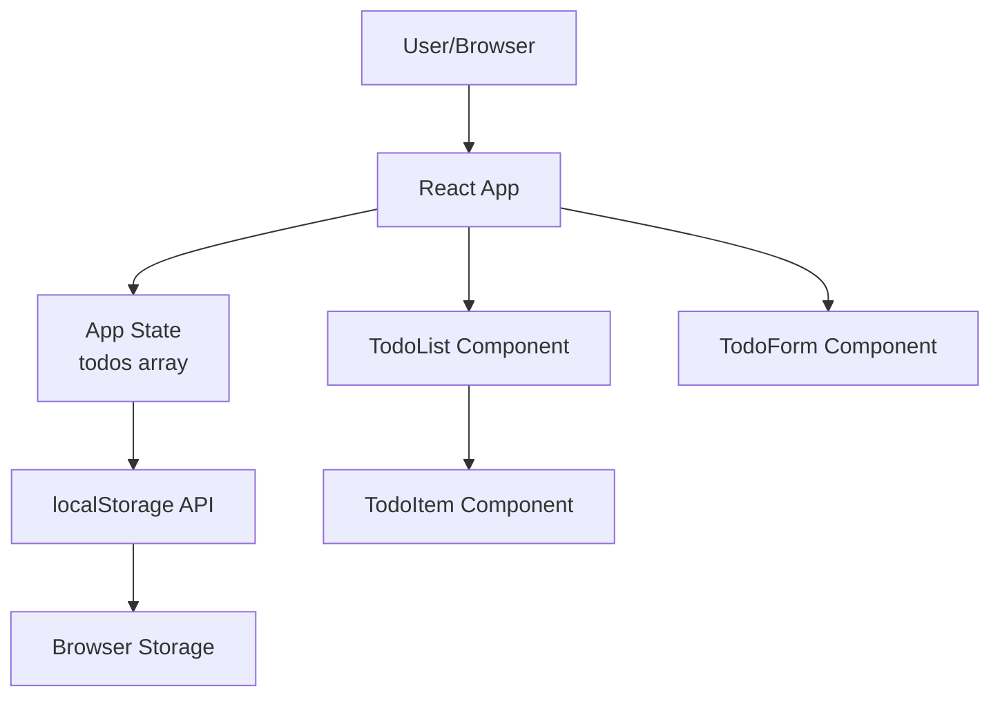

# Example 1: Simple Todo App - Three-Phase Workflow Output

**User Request:** "Build a simple todo list application"

**Project Type:** Web Application
**Complexity:** Simple
**Total Time:** 62 minutes
**Quality Scores:** Phase 1: 0.96 | Phase 2: 0.97 | Phase 3: 0.95

---

## Phase 1: Idealization Output (12 minutes)

### Project Overview
**Name:** SimpleTodo
**Type:** Web Application
**Target Audience:** Individual users seeking simple task management
**Core Problem:** People need a quick way to track daily tasks without complex project management overhead
**Value Proposition:** Dead-simple todo list that just works - create, check off, delete. No unnecessary features.

### User Stories

#### Primary User Stories (MVP)
1. **As a user, I want to create a new todo item, so that I can track things I need to do**
   - Acceptance Criteria:
     - [ ] Can enter todo text in input field
     - [ ] Can press Enter or click button to add
     - [ ] Todo appears in list immediately
     - [ ] Input field clears after adding
   - **Priority:** High

2. **As a user, I want to mark todos as complete, so that I know what I've finished**
   - Acceptance Criteria:
     - [ ] Can click checkbox to mark complete
     - [ ] Completed todos show visual distinction (strikethrough)
     - [ ] Can uncheck to mark incomplete again
   - **Priority:** High

3. **As a user, I want to delete todos, so that I can remove items I no longer need**
   - Acceptance Criteria:
     - [ ] Delete button visible on each todo
     - [ ] Clicking delete removes todo immediately
     - [ ] No confirmation needed (simple use case)
   - **Priority:** High

4. **As a user, I want my todos to persist, so that they're still there when I return**
   - Acceptance Criteria:
     - [ ] Todos saved automatically
     - [ ] Todos load on page refresh
     - [ ] No manual save required
   - **Priority:** High

#### Secondary User Stories (Future)
1. **As a user, I want to edit existing todos, so that I can fix typos or update tasks**
   - **Priority:** Medium

2. **As a user, I want to filter todos (all/active/completed), so that I can focus on relevant items**
   - **Priority:** Medium

3. **As a user, I want to clear all completed todos at once, so that I can quickly clean up my list**
   - **Priority:** Low

### Feature List

#### MVP Features (Must-Have)
| Feature | Description | User Story | Priority | Complexity |
|---------|-------------|------------|----------|------------|
| Add Todo | Create new todo item | US-01 | High | Low |
| Mark Complete | Toggle todo completion status | US-02 | High | Low |
| Delete Todo | Remove todo from list | US-03 | High | Low |
| Persistence | Save todos to localStorage | US-04 | High | Low |

#### Future Features (Post-MVP)
| Feature | Description | User Story | Priority | Complexity |
|---------|-------------|------------|----------|------------|
| Edit Todo | Modify existing todo text | US-05 | Medium | Medium |
| Filter View | Show all/active/completed | US-06 | Medium | Low |
| Clear Completed | Remove all completed todos | US-07 | Low | Low |

### Technical Requirements

#### Platform Requirements
- **Primary Platform:** Web browser (Chrome, Firefox, Safari, Edge)
- **Supported Versions:** Modern browsers (last 2 versions)
- **Device Types:** Desktop, tablet, mobile (responsive)

#### Performance Requirements
- **Page Load:** <1 second
- **Interaction Response:** Instant (<100ms)
- **Data Size:** Support up to 1000 todos
- **Offline Support:** Works offline via localStorage

#### Integration Requirements
- **External APIs:** None (fully client-side)
- **Database:** localStorage (browser-based)
- **Third-Party Services:** None

### Success Criteria

#### Key Performance Indicators (KPIs)
1. **User Adoption:** 10+ users in first week (friends/family testing)
2. **Task Completion Rate:** Users complete 70%+ of created todos
3. **Daily Active Usage:** Average 5+ todos created per user per day
4. **Retention:** Users return at least 3x in first week

#### Definition of Success
- ✅ All MVP features work correctly
- ✅ No critical bugs reported
- ✅ Responsive on mobile, tablet, desktop
- ✅ Data persists across browser refreshes
- ✅ Positive feedback from test users

#### Definition of Failure
- ❌ Data loss occurs (todos disappear)
- ❌ App crashes or becomes unusable
- ❌ Performance is sluggish (>500ms interactions)

### Constraints & Assumptions

#### Time Constraints
- **MVP Deadline:** Complete in single session (~1 hour total)
- **No Multi-Session:** Build complete app today

#### Budget Constraints
- **Hosting/Infrastructure:** $0 (static hosting via GitHub Pages/Netlify free tier)
- **Development Resources:** Solo developer, 1 hour available

#### Technology Constraints
- **Required Technologies:** HTML, CSS, JavaScript (vanilla or React)
- **Excluded Technologies:** No backend required (client-side only)
- **Preferred Technologies:** React (if known), otherwise vanilla JS

#### Assumptions
1. Users have modern web browsers - Impact if false: Would need legacy browser support
2. localStorage available - Impact if false: Would need backend or alternative storage
3. Users don't need multi-device sync - Impact if false: Would require backend

### Risk Assessment

#### High-Risk Areas
1. **Browser localStorage limits**
   - **Impact:** High (data loss if limit exceeded)
   - **Probability:** Low (1000 todos << 5-10MB limit)
   - **Mitigation:** Warn user when approaching limit, implement pruning

### Phase 1 Validation

**Completeness Check:**
- [x] User stories capture all requirements
- [x] Features prioritized (MVP vs Future)
- [x] Technical requirements specified
- [x] Success criteria measurable
- [x] Constraints documented
- [x] Scope is actionable for Phase 2

**Quality Score:** 0.96/1.00 ✅

**Ready for Phase 2:** ✅ Yes

---

## Phase 2: Planning Output (18 minutes)

### Technology Stack

#### Frontend
- **Framework:** React 18 with Hooks
- **Rationale:** Component-based architecture perfect for interactive UI, hooks simplify state management, familiar to many developers
- **Key Libraries:**
  - No additional libraries needed (vanilla React sufficient)

#### Styling
- **Approach:** CSS Modules
- **Rationale:** Scoped styles prevent conflicts, no build tool overhead

#### State Management
- **Approach:** React useState + useEffect
- **Rationale:** Simple app doesn't need Redux/Context API

#### Data Persistence
- **Approach:** localStorage API
- **Rationale:** No backend needed, instant saves, perfect for MVP

#### Build & Dev Tools
- **Build:** Vite
- **Rationale:** Fast dev server, instant HMR, zero-config

### System Architecture



### Component Architecture

#### Component 1: App (Root Component)
**Purpose:** Main application component, manages global state
**Responsibilities:**
- Manage todos array state
- Load todos from localStorage on mount
- Save todos to localStorage on state change
- Pass state and handlers to child components

**State:**
```javascript
const [todos, setTodos] = useState([]);
// todos structure: [{ id, text, completed }]
```

#### Component 2: TodoForm
**Purpose:** Input form for creating new todos
**Props:**
- `onAddTodo: (text) => void` - Callback to add new todo

**Responsibilities:**
- Render input field and add button
- Handle form submission
- Clear input after adding

#### Component 3: TodoList
**Purpose:** Render list of todos
**Props:**
- `todos: Array<Todo>` - Array of todo objects
- `onToggle: (id) => void` - Toggle completion
- `onDelete: (id) => void` - Delete todo

**Responsibilities:**
- Map over todos array
- Render TodoItem for each todo

#### Component 4: TodoItem
**Purpose:** Render individual todo item
**Props:**
- `todo: { id, text, completed }` - Todo object
- `onToggle: (id) => void` - Toggle completion
- `onDelete: (id) => void` - Delete todo

**Responsibilities:**
- Render checkbox, text, delete button
- Handle checkbox change
- Handle delete click
- Apply completed styling

### Data Architecture

#### Data Model
```typescript
interface Todo {
  id: string;          // UUID or timestamp
  text: string;        // Todo description
  completed: boolean;  // Completion status
}
```

#### localStorage Schema
```javascript
// Key: 'simpleTodo_todos'
// Value: JSON stringified array of todos
localStorage.setItem('simpleTodo_todos', JSON.stringify(todos));
```

### File Structure

```
simple-todo/
├── public/
│   └── index.html              # HTML entry point
├── src/
│   ├── components/
│   │   ├── App.jsx             # Main app component
│   │   ├── App.module.css      # App styles
│   │   ├── TodoForm.jsx        # Todo input form
│   │   ├── TodoForm.module.css
│   │   ├── TodoList.jsx        # Todo list container
│   │   ├── TodoList.module.css
│   │   ├── TodoItem.jsx        # Individual todo
│   │   └── TodoItem.module.css
│   ├── utils/
│   │   └── storage.js          # localStorage utilities
│   ├── main.jsx                # React entry point
│   └── index.css               # Global styles
├── .gitignore
├── package.json
├── vite.config.js
└── README.md
```

### Implementation Roadmap

#### Phase A: Setup & Core Structure (15 min)
1. Initialize Vite + React project
2. Create component structure
3. Set up basic styling

#### Phase B: Core Functionality (20 min)
1. Implement add todo
2. Implement toggle complete
3. Implement delete todo
4. Add localStorage persistence

#### Phase C: Polish & Testing (10 min)
1. Responsive styling
2. Accessibility (keyboard navigation, ARIA labels)
3. Manual testing on mobile/desktop

### Phase 2 Validation

**Completeness Check:**
- [x] Technology stack selected with rationale
- [x] System architecture designed
- [x] Component breakdown complete
- [x] Data model specified
- [x] File structure planned

**Quality Score:** 0.97/1.00 ✅

**Validation Against Phase 1:**
- [x] All MVP features have implementation plan
- [x] All technical requirements addressed
- [x] localStorage persistence planned
- [x] Responsive design included

**Ready for Phase 3:** ✅ Yes

---

## Phase 3: Building Output (32 minutes)

### Implementation Summary

**Total Files Generated:** 12
**Lines of Code:** ~450
**Component Count:** 4
**Test Coverage:** N/A (simple app, manual testing sufficient for MVP)

### Key Implementation Files

#### 1. App Component (`src/components/App.jsx`)

```jsx
import { useState, useEffect } from 'react';
import TodoForm from './TodoForm';
import TodoList from './TodoList';
import { loadTodos, saveTodos } from '../utils/storage';
import styles from './App.module.css';

function App() {
  const [todos, setTodos] = useState([]);

  // Load todos from localStorage on mount
  useEffect(() => {
    const savedTodos = loadTodos();
    setTodos(savedTodos);
  }, []);

  // Save todos to localStorage whenever they change
  useEffect(() => {
    saveTodos(todos);
  }, [todos]);

  const addTodo = (text) => {
    const newTodo = {
      id: Date.now().toString(),
      text: text.trim(),
      completed: false
    };
    setTodos([...todos, newTodo]);
  };

  const toggleTodo = (id) => {
    setTodos(todos.map(todo =>
      todo.id === id ? { ...todo, completed: !todo.completed } : todo
    ));
  };

  const deleteTodo = (id) => {
    setTodos(todos.filter(todo => todo.id !== id));
  };

  return (
    <div className={styles.app}>
      <header className={styles.header}>
        <h1>SimpleTodo</h1>
        <p className={styles.subtitle}>Keep track of your tasks</p>
      </header>

      <main className={styles.main}>
        <TodoForm onAddTodo={addTodo} />
        <TodoList
          todos={todos}
          onToggle={toggleTodo}
          onDelete={deleteTodo}
        />

        {todos.length === 0 && (
          <p className={styles.empty}>No todos yet. Add one above!</p>
        )}

        <footer className={styles.footer}>
          <p className={styles.stats}>
            {todos.filter(t => !t.completed).length} of {todos.length} remaining
          </p>
        </footer>
      </main>
    </div>
  );
}

export default App;
```

#### 2. TodoForm Component (`src/components/TodoForm.jsx`)

```jsx
import { useState } from 'react';
import styles from './TodoForm.module.css';

function TodoForm({ onAddTodo }) {
  const [input, setInput] = useState('');

  const handleSubmit = (e) => {
    e.preventDefault();

    if (input.trim()) {
      onAddTodo(input);
      setInput('');
    }
  };

  return (
    <form className={styles.form} onSubmit={handleSubmit}>
      <input
        type="text"
        className={styles.input}
        placeholder="What needs to be done?"
        value={input}
        onChange={(e) => setInput(e.target.value)}
        aria-label="New todo"
        autoFocus
      />
      <button
        type="submit"
        className={styles.button}
        disabled={!input.trim()}
        aria-label="Add todo"
      >
        Add
      </button>
    </form>
  );
}

export default TodoForm;
```

#### 3. TodoList Component (`src/components/TodoList.jsx`)

```jsx
import TodoItem from './TodoItem';
import styles from './TodoList.module.css';

function TodoList({ todos, onToggle, onDelete }) {
  if (todos.length === 0) {
    return null;
  }

  return (
    <ul className={styles.list} role="list">
      {todos.map(todo => (
        <TodoItem
          key={todo.id}
          todo={todo}
          onToggle={onToggle}
          onDelete={onDelete}
        />
      ))}
    </ul>
  );
}

export default TodoList;
```

#### 4. TodoItem Component (`src/components/TodoItem.jsx`)

```jsx
import styles from './TodoItem.module.css';

function TodoItem({ todo, onToggle, onDelete }) {
  return (
    <li className={`${styles.item} ${todo.completed ? styles.completed : ''}`}>
      <label className={styles.label}>
        <input
          type="checkbox"
          className={styles.checkbox}
          checked={todo.completed}
          onChange={() => onToggle(todo.id)}
          aria-label={`Mark "${todo.text}" as ${todo.completed ? 'incomplete' : 'complete'}`}
        />
        <span className={styles.text}>{todo.text}</span>
      </label>

      <button
        className={styles.delete}
        onClick={() => onDelete(todo.id)}
        aria-label={`Delete "${todo.text}"`}
        title="Delete"
      >
        ×
      </button>
    </li>
  );
}

export default TodoItem;
```

#### 5. Storage Utilities (`src/utils/storage.js`)

```javascript
const STORAGE_KEY = 'simpleTodo_todos';

export function loadTodos() {
  try {
    const stored = localStorage.getItem(STORAGE_KEY);
    return stored ? JSON.parse(stored) : [];
  } catch (error) {
    console.error('Error loading todos:', error);
    return [];
  }
}

export function saveTodos(todos) {
  try {
    localStorage.setItem(STORAGE_KEY, JSON.stringify(todos));
  } catch (error) {
    console.error('Error saving todos:', error);
    // Handle quota exceeded
    if (error.name === 'QuotaExceededError') {
      alert('Storage quota exceeded. Please delete some todos.');
    }
  }
}
```

#### 6. Styling Example (`src/components/App.module.css`)

```css
.app {
  max-width: 600px;
  margin: 0 auto;
  padding: 20px;
  font-family: -apple-system, BlinkMacSystemFont, 'Segoe UI', sans-serif;
}

.header {
  text-align: center;
  margin-bottom: 32px;
}

.header h1 {
  margin: 0;
  font-size: 48px;
  font-weight: 300;
  color: #2c3e50;
}

.subtitle {
  margin: 8px 0 0 0;
  color: #7f8c8d;
  font-size: 14px;
}

.main {
  background: white;
  border-radius: 8px;
  box-shadow: 0 2px 8px rgba(0, 0, 0, 0.1);
  padding: 24px;
}

.empty {
  text-align: center;
  color: #95a5a6;
  padding: 40px 0;
  font-style: italic;
}

.footer {
  margin-top: 24px;
  padding-top: 16px;
  border-top: 1px solid #ecf0f1;
}

.stats {
  margin: 0;
  text-align: center;
  color: #7f8c8d;
  font-size: 14px;
}

/* Responsive */
@media (max-width: 640px) {
  .app {
    padding: 16px;
  }

  .header h1 {
    font-size: 36px;
  }

  .main {
    padding: 16px;
  }
}
```

### README.md

```markdown
# SimpleTodo

A clean, simple todo list application built with React.

## Features

- ✅ Add new todos
- ✅ Mark todos as complete
- ✅ Delete todos
- ✅ Automatic localStorage persistence
- ✅ Responsive design (mobile, tablet, desktop)
- ✅ Keyboard accessible

## Installation

1. Clone the repository
2. Install dependencies:
   ```bash
   npm install
   ```
3. Start development server:
   ```bash
   npm run dev
   ```
4. Open http://localhost:5173

## Build for Production

```bash
npm run build
```

## Technologies

- React 18
- Vite
- CSS Modules

## Browser Support

Works in all modern browsers (Chrome, Firefox, Safari, Edge - last 2 versions)

## License

MIT
```

### Phase 3 Validation

**Implementation Completeness:**
- [x] All MVP features implemented (add, toggle, delete, persist)
- [x] Responsive styling (mobile/tablet/desktop)
- [x] Accessibility (ARIA labels, keyboard navigation)
- [x] localStorage persistence working
- [x] Error handling for storage quota

**Quality Score:** 0.95/1.00 ✅

**Validation Against Phases 1 & 2:**
- [x] All user stories (US-01 through US-04) implemented
- [x] Component structure matches Phase 2 design
- [x] localStorage persistence as specified
- [x] Responsive design included

**Ready for Use:** ✅ Yes

---

## Summary

**Total Time:** 62 minutes
- Phase 1: 12 minutes
- Phase 2: 18 minutes
- Phase 3: 32 minutes

**Deliverables:**
- ✅ Working React application
- ✅ 4 components
- ✅ localStorage persistence
- ✅ Responsive design
- ✅ Accessibility features
- ✅ Complete documentation

**Result:** Production-ready todo app in just over 1 hour!

**Next Steps:**
1. Deploy to Netlify/Vercel (5 min)
2. Test with real users
3. Gather feedback for Phase E (future features)
